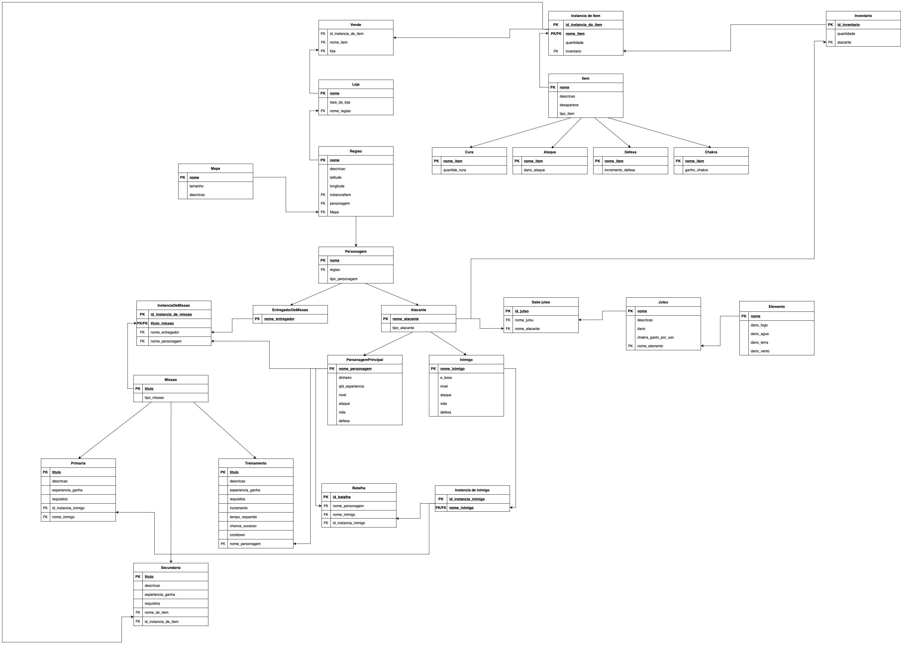
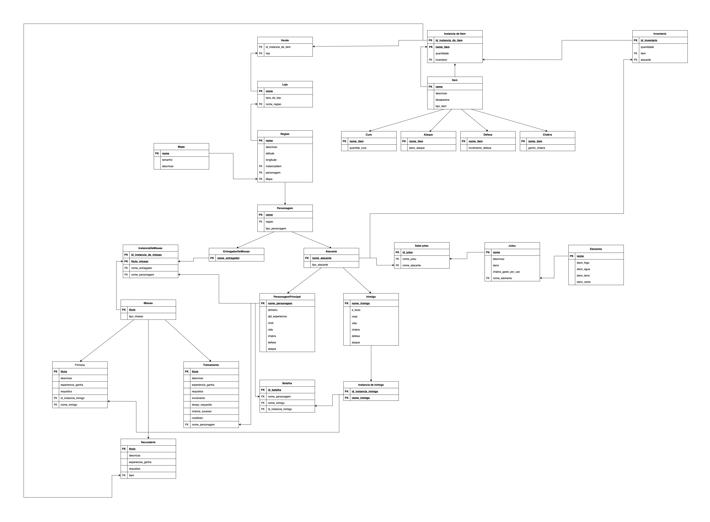

# Modelo Relacional

## Introdução

Este documento tem como objetivo representar os dados da aplicação, em formato de tabelas, que serão futuramente implementados em um sistema gerenciador de banco de dados.

## Versão 1.1

[Clique aqui ou na imagem para ver o modelo relacional com mais detalhes](./images/modelo-relacional12.jpg)
## Versão 1.0

[Clique aqui ou na imagem para ver o modelo relacional com mais detalhes](./images/modelo-relacional-1.0.jpg)

## Histórico de versões

|    Data    | Versão |          Descrição                         | Autor(es) |
| :--------: | :----: | :----------------------------------------: | :----:
| 26/11/2022 | `1.0`  | Criação da versão 1.0 do Modelo Relacional | [Caio Vitor](https://github.com/caiozim112), [Maciel Júnior](https://github.com/macieljuniormax)
| 28/11/2022 | `1.1`  | Correções no Modelo Relacional | [Eliseu Kadesh](https://github.com/eliseukadesh67), [Maciel Júnior](https://github.com/macieljuniormax)