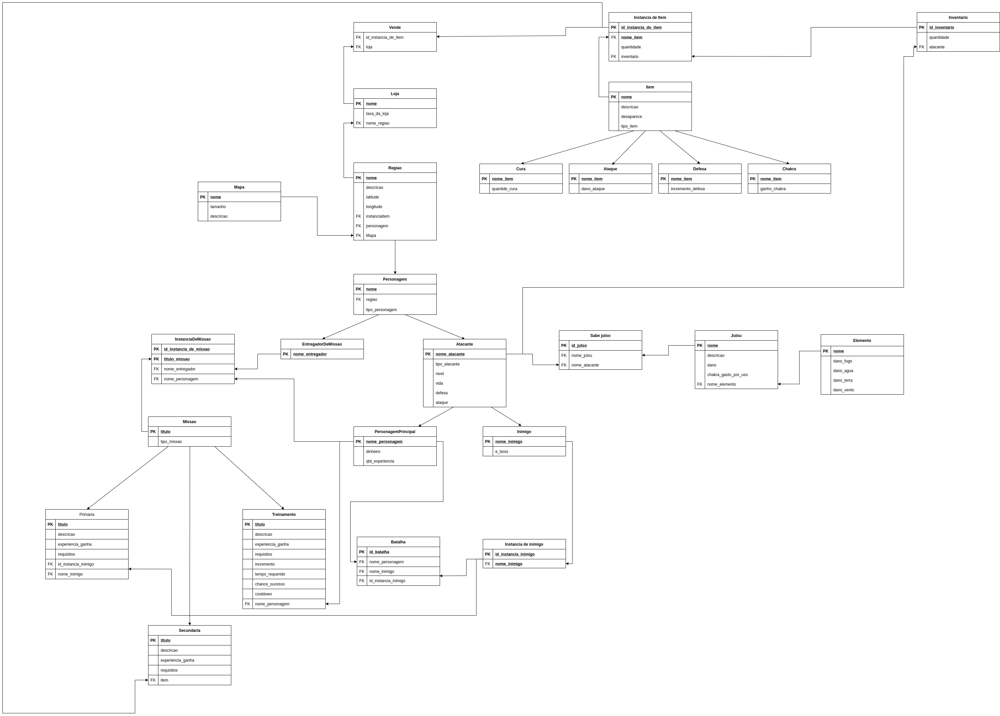

# Modelo Relacional

## Introdução

Este documento tem como objetivo representar os dados da aplicação, em formato de tabelas, que serão futuramente implementados em um sistema gerenciador de banco de dados.

## Versão 1.0

[Clique aqui ou na imagem para ver o modelo relacional com mais detalhes](./images/modelo-relacional-1.0.jpg)