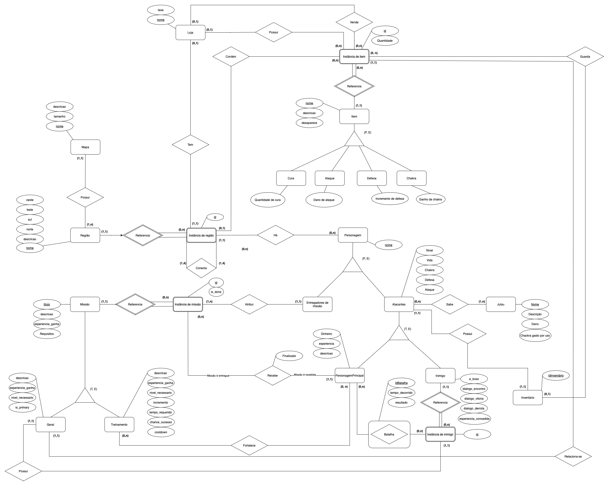

# Modelo Entidade Relacional (MER)

## Introdução

O MER (Modelo Entidade Relacionamento) é utilizado para descrever os objetos do mundo real através de entidades, que possuem atributos e relacionamentos para descrever suas propriedades e, desssa forma, representar os aspectos estáticos do Domínio da Aplicação.

O DER (Diagrama Entidade-Relacionamento) é utilizado para representar em forma gráfica o que foi descrito no MER (Modelo Entidade Relacionamento).

## Diagrama Entidade-Relacionamento (Versão v3.2)

[Clique aqui ou na imagem para ver o DER com mais detalhes](../images/diagrama-entidade-relacionamento-v32.png)

## Diagrama Entidade-Relacionamento (Versão v3.1)

[Clique aqui ou na imagem para ver o DER com mais detalhes](../images/diagrama-entidade-relacionamento-v31.png)

## Diagrama Entidade-Relacionamento (Versão v3.0)

[Clique aqui ou na imagem para ver o DER com mais detalhes](../images/diagrama-entidade-relacionamento-v3.png)

## Diagrama Entidade-Relacionamento (Versão v2.0)

### Versão v1.0

## Histórico de versões

|    Data    | Versão |                                  Descrição                                  |        Autor         |
| :--------: | :----: | :-------------------------------------------------------------------------: | :------------------: |
| 28/11/2022 | `1.0`  |                        Criação da versão 1.0 do DER                         | Todos os integrantes |
| 28/11/2022 | `2.0`  |                     Atualização do DER para versão 2.0                      |     João Coelho      |
| 09/01/2022 | `3.0`  |                     Atualização do DER para versão 3.0                      | Todos os integrantes |
| 15/01/2022 | `3.1`  | Adiciona Instância de Região e exclui entidade Elemento e missão Secundária |    Maciel Júnior     |
| 16/01/2022 | `3.2`  |                            Remoção entidade Mapa                            |   Maurício Machado   |
